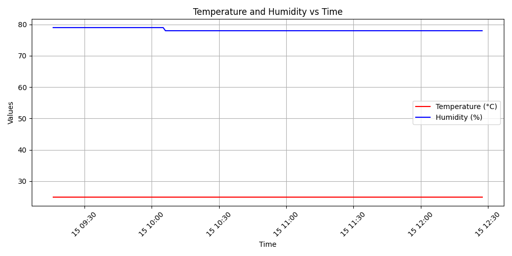

# collect_arduino

## Objectif

Ce dépôt a pour objectif de collecter les données des capteurs du kit `Starter Kit UNO R3 Project` à l'aide d'une carte Arduino. Chaque capteur a son propre répertoire dédié, contenant le code Arduino et les scripts nécessaires pour lire et enregistrer les données depuis le port série de la carte.

## Structure du Dépôt

Le dépôt est organisé comme suit :

```yaml
collect_arduino/
│
├── README.md
├── list_ports.py    # script python pour avoir la liste des ports séries
├── requirements.txt # librairies python à installer
├── DHT11/           # Répertoire pour le capteur DHT11
│   ├── sketch.ino     # code Arduino pour le capteur DHT11 (contenant en début de code les librairies à installer)
│   ├── read.py        # script python pour lire les données du capteur DHT11
│   ├── explore.py     # script python pour visualiser les données collectés du capteur DHT11
│   └── ...
└── ...                # Autres répertoires pour les autres capteurs
```

## Capteurs du Kit

Voici la liste des capteurs avec leurs répertoires respectifs :

- **DHT11** : Capteur de température et d'humidité

- **BMP180** : Capteur de pression atmosphérique
- **LDR** : Capteur de lumière (photo-résistance)
- **HC-SR04** : Capteur de distance ultrasonique
- **MQ-2** : Capteur de gaz
- ...

## Prérequis

- Une carte Arduino UNO R3 (Pour le moment)
- Le logiciel Arduino IDE (Pour téléverser les codes et à installer les librairies néccessaire correspondant)
- Les bibliothèques (librairies) Arduino nécessaires pour chaque capteur (voir les instructions spécifiques dans chaque répertoire de capteur)
- Python 3.x pour exécuter les scripts de lecture des données
